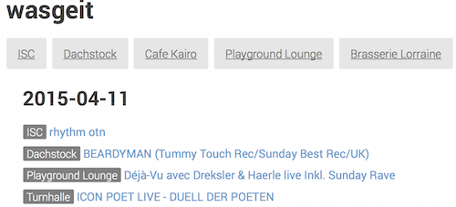

# wasgeit
Minimalistic concert/event aggregator with web frontend

# Tech stack
## Frontend
- [React.js](https://facebook.github.io/react/)
- [Flux](http://facebook.github.io/flux/)
- [Webpack](http://webpack.github.io/)
- [Babel ES6 transpiler](https://babeljs.io/)
- [Restul.js](https://github.com/marmelab/restful.js)Men

##Backend
- [Python 3](https://www.python.org/)
- [Flask](http://flask.pocoo.org/)
- [Feedparser](https://pythonhosted.org/feedparser/)
- [PyQuery](http://pythonhosted.org//pyquery/)

# React.js resources
- http://www.code-experience.com/async-requests-with-react-js-and-flux-revisited/
- https://github.com/facebook/flux/tree/0a77b950723f4510948fcc4041f040a4b6c49bf5/examples
